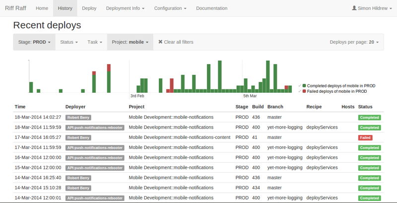
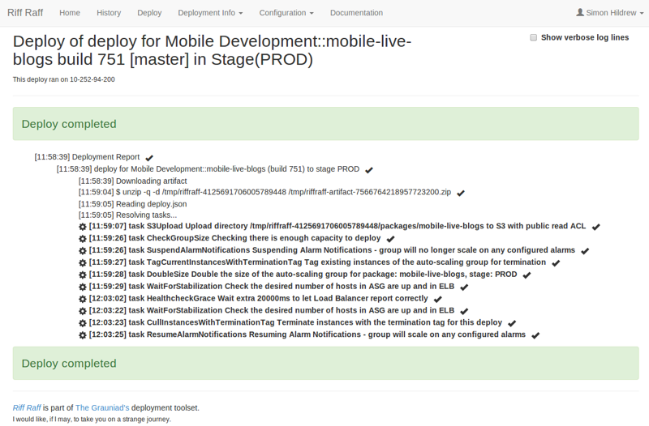
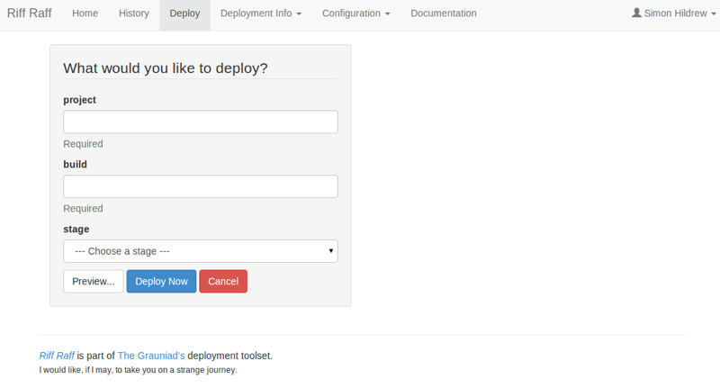
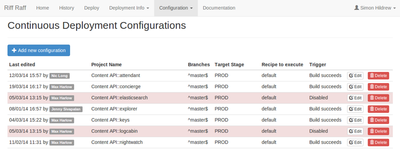

Riff-Raff
=========

"Deploy the transit beam"

About
-----

The Guardian's scala-based deployment system is designed to help automate
deploys by providing:

 - a library (Magenta) that localises knowledge about how to orchestrate deploys within a
 single system, but having defined interfaces with the applications and the
 system on to which the deploys will happen.
 - a web application (Riff-Raff) that initiates and audits deploys as well as providing
 various integration points for automating deployment pipelines.

Requirements
-----

Riff-Raff and Magenta have been built with the tools we use at the Guardian
and you will find it easiest if you use a similar set of tools. Riff-Raff has

 - has tight integration with TeamCity (we have experimented with adding Jenkins and TravisCI with some success)
 - uses [Prism](http://github.com/guardian/prism) to do service discovery
 - stores all configuration, history and logs in a MongoDB instance

Documentation
-----

Most of the documentation is under [magenta-lib/docs](magenta-lib/docs) (for the main deployment library)
and [riff-raff/app/docs](riff-raff/app/docs) (for the web frontend).

In action
-----

Screenshots don't do a lot to show how Riff-Raff works in practice - but here are
a handful anyway, just to give a hint.

The deploy history view - showing all deploys that have ever been done
(in this case filtered on PROD and projects containing 'mobile')

This is what a single deploy looks like - displaying the overall result and the list of tasks that were executed.

The simple form for requesting a deploy can be seen here (further options are available after previewing)

Riff-Raff polls our build server frequently and can be configured to automatically start a deploy for newly
completed builds

How do I run Riff-Raff locally if I want to hack on it?
-------------------------------------------------------

Assuming you have a reasonably recent version of Java installed, 

 * Create a basic configuration file at ~/.gu/riff-raff.properties (teamcity and mondo config if probably the minimum)
 * Run the sbt script
 * enter `project riff-raff` at the SBT prompt
 * enter `run` at the SBT prompt
 * visit http://localhost:9000/
 * Details of how to configure Riff-Raff can then be found at http://localhost:9000/docs/riffraff/properties 

What is still left to do?
------

See the `TODO.txt` file in this project
