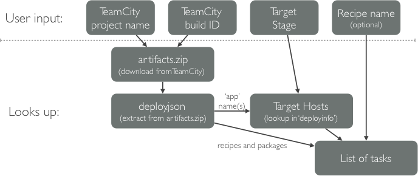

<!--- prev:index next:terminology -->
How magenta works
=================

Magenta needs three to five bits of user input in order to start a deploy:

 - project name
 - build number
 - Target stage
 - Recipe name (optional)
 - Hostname filter (optional)

The diagram below gives an overview of how the process hangs together. In essence,
magenta tries to download a file called `artifacts.zip` that it expects
to be an artifact of the build with an S3 path of the form `project-name/build-number/artifacts.zip`

Once it has downloaded that archive, it will extract the `/deploy.json` file from it.
This file contains `packages` and `recipes` that give magenta enough information to know
how to deploy the project. For deploys that involve specific hosts, the `app` name is
used to look up the target hosts that will be deployed to. These target hosts can be
filtered in order to deploy to only a subset of hosts.

Magenta then generates a list of tasks that need to be executed in order to carry out
the deploy.

Finally, the tasks are executed in sequential order.

